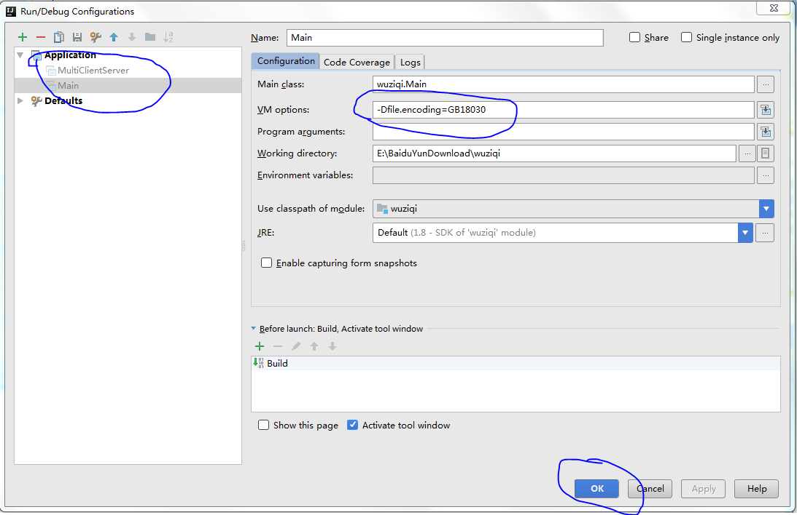
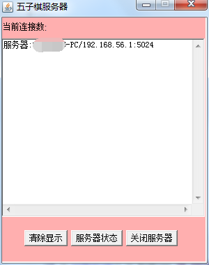
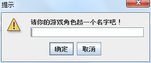
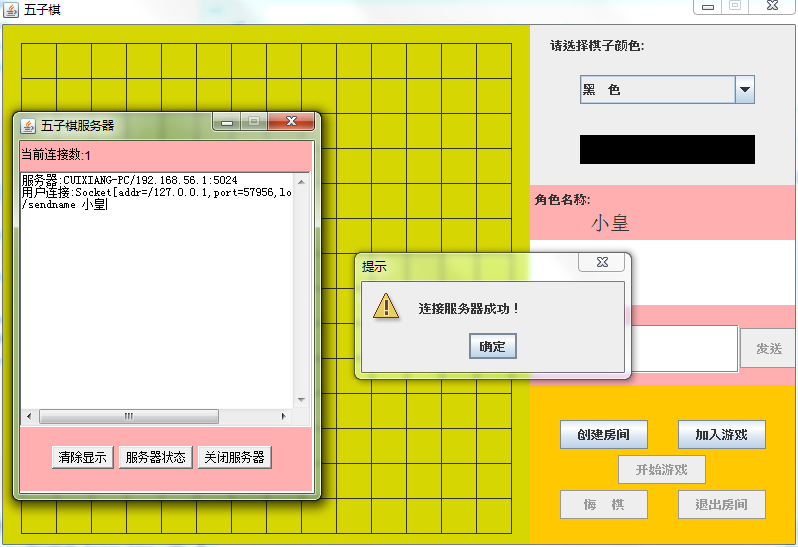

五子棋
----

我的博客：[并非菜鸟](https://songyaxu.github.io)
=====
## 介绍
这个项目是一个稍微有点复杂的java程序。是我在学习完java之后的一个练习程序，写的不是很好，可能还有一些**BUG**，望大家谅解。
这个五子棋的特点：

1. 多用户：支持多个用户同事在线玩游戏
2. 聊天系统：支持实时聊天功能
3. 支持公网IP

## 说明
本程序使用**IntelliJ IDEA 2017.1 x64**编写。

导入程序之后先确定编译器的文件编码是否为UTF-8，如果不是可能会出现中文乱码的情况。

在运行awt是也可能出现中文乱码的情况请将服务器端和客户端分别进行以下配置**Run->Edit Configurations**：



左侧有两个application都设置相同的设置
**-Dfile.encoding=GB18030**

我们先运行一服务器端：



然后分别开启2个客户端



我们输入一个名字：小皇

看到提示成功连接，并在服务器端看到了相应用户连接的信息。



其他的功能这里就不细说了。感觉还是可以的。无聊的时候在公司2个人可以一起玩五子棋啊。

``` java
public void messageTransfer(String message)
```
这里边封装着几乎所有的通信规则

| 字符串 | 名称 | 作用 |
| --- | --- | --- |
|/sendname|发送刚进入的用户的名称|获取新用户，并加入队列|
肯定是无聊坏了！

## 总结

一个JAVA学习的练习，考验了java的一些基础知识，还是很不错的例子！如果你喜欢我的程序，或者运行时出现了BUG，还希望你能指出哦。