五子棋
----

我的博客：[并非菜鸟](https://songyaxu.github.io)
=====
## 介绍
这个项目是一个稍微有点复杂的java程序。是我在学习完java之后的一个练习程序，写的不是很好，可能还有一些**BUG**，望大家谅解。
这个五子棋的特点：

1. 多用户：支持多个用户同事在线玩游戏
2. 聊天系统：支持实时聊天功能
3. 支持公网IP

## 说明
本程序使用**IntelliJ IDEA 2017.1 x64**编写。

导入程序之后先确定编译器的文件编码是否为UTF-8，如果不是可能会出现中文乱码的情况。

在运行awt是也可能出现中文乱码的情况请将服务器端和客户端分别进行以下配置**Run->Edit Configurations**：


左侧有两个application都设置相同的设置
**-Dfile.encoding=GB18030**

我们先运行一服务器端：


然后分别开启2个客户端


我们输入一个名字：小皇

看到提示成功连接，并在服务器端看到了相应用户连接的信息。


其他的功能这里就不细说了。感觉还是可以的。无聊的时候在公司2个人可以一起玩五子棋啊。肯定是无聊坏了！

``` java
public void messageTransfer(String message)
```
这里边封装着几乎所有的通信规则：

| 字符串 | 名称 | 作用 |
| --- | --- | --- |
|/sendname|发送刚进入的用户的名称|获取新用户，并加入队列|
|/listroom|列出所有房间|获取所有房间|
|/creategame|创建房间|创建新的游戏房间|
|/joingame|加入房间|用户加入房间|
|/joinok|加入成功|提示用户加入成功，或者有人加入|
|/reject|系统识别为无效命令|系统识别为无效命令|
|/talk|聊天|互相发送聊天信息|
|/giveup|放弃游戏|提示对方游戏中途退出|
|/youwin|获胜|意识获胜方获胜|
|/startgame|开始游戏|点击开始游戏|
|/wait|等待|等待|
|/ready|准备开始|准备开始|
|/youfirst|你下下棋|提示谁第一个下棋|
|/youfail|提示失败方失败了|提示失败|
|/chess|发送下棋的位置|获取棋子显示的位置|
|/takeback|悔棋|悔棋|

更多关于界面的截图

创建房间成功：

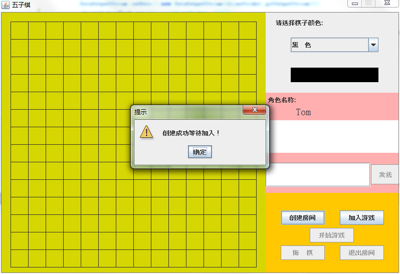

加入游戏界面：

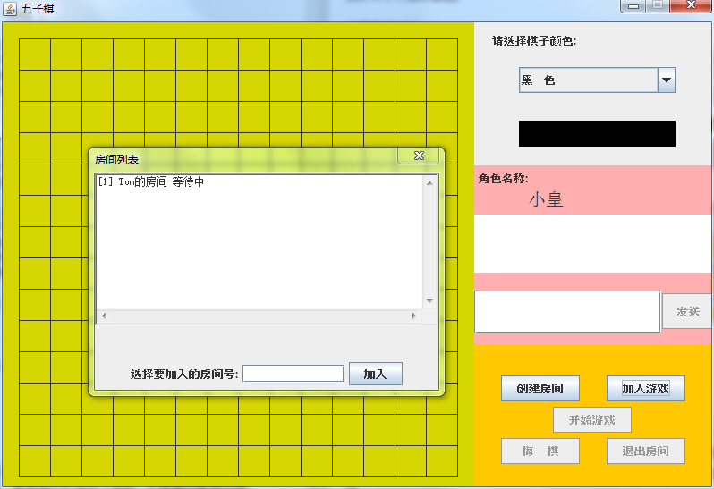

加入房间后：

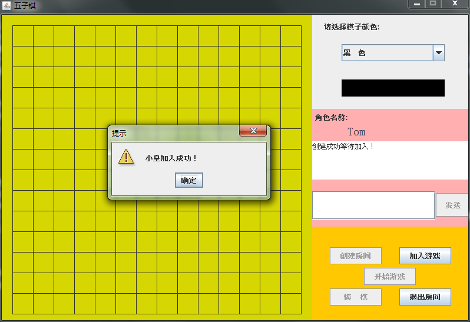

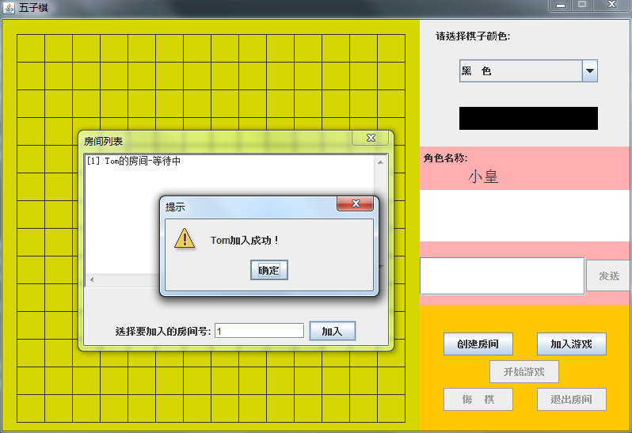

选择完棋子颜色之后点击开始下棋，并发送一些消息

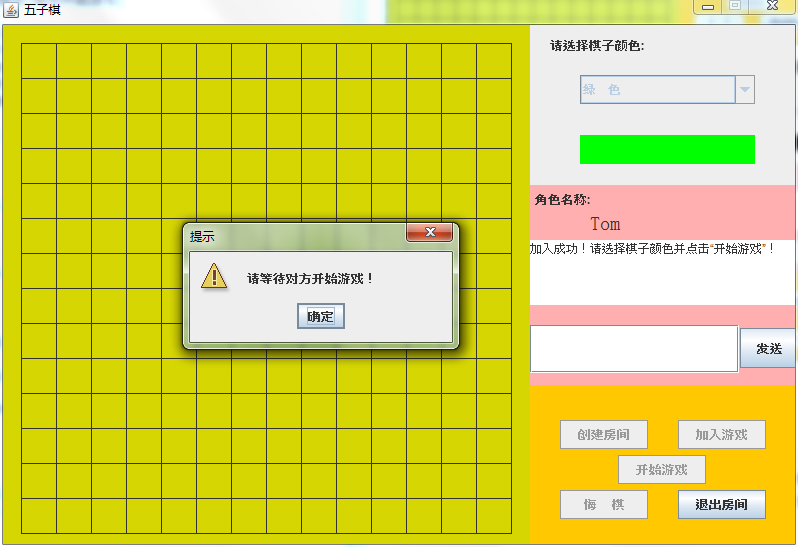

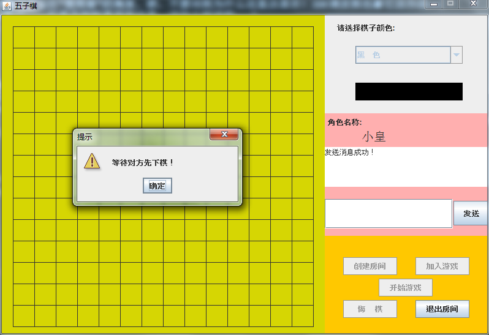

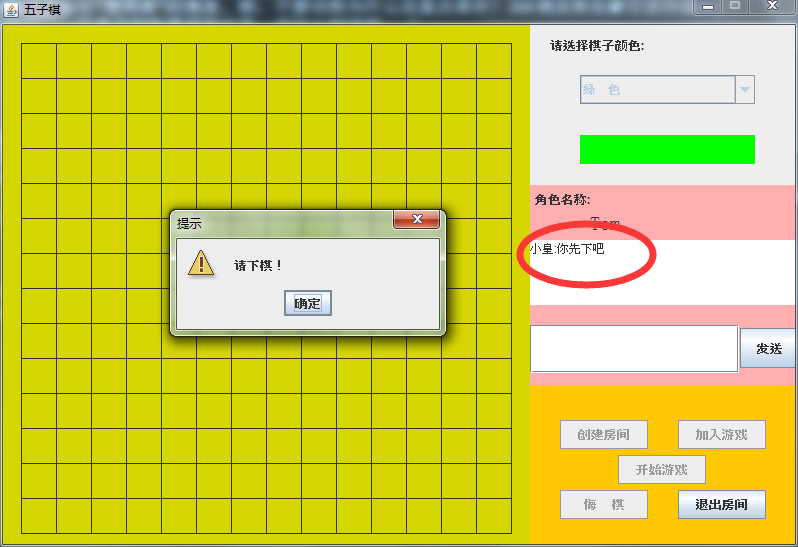

下棋过程中刚下的棋子是正方形的：
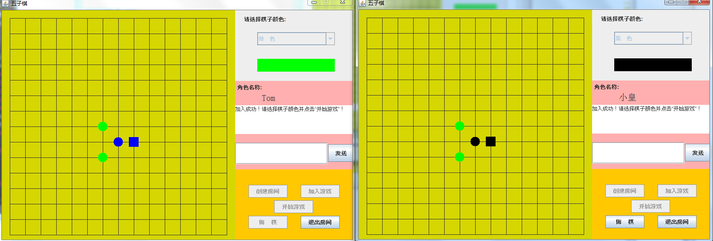

悔棋
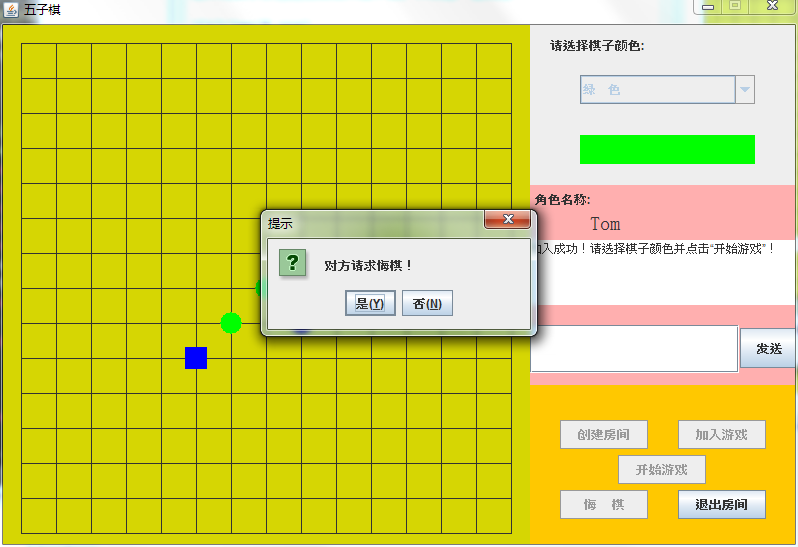
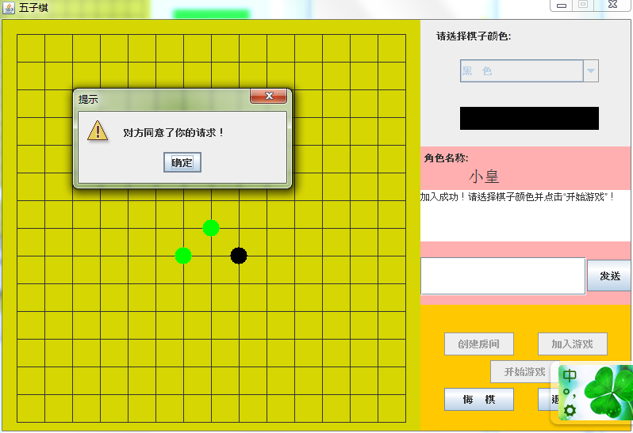

逃跑

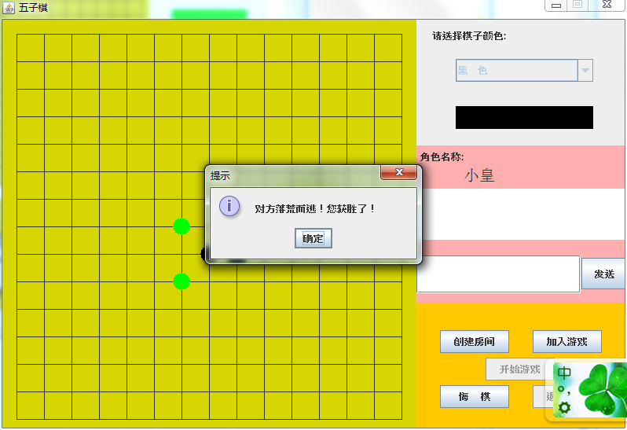
下面是比赛结果。

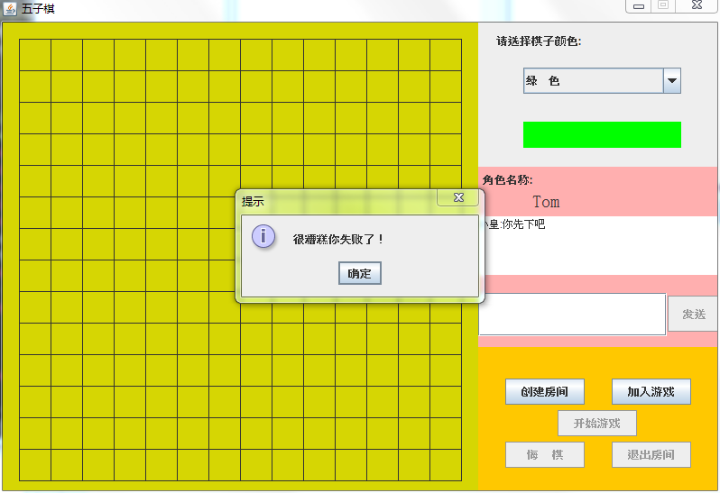
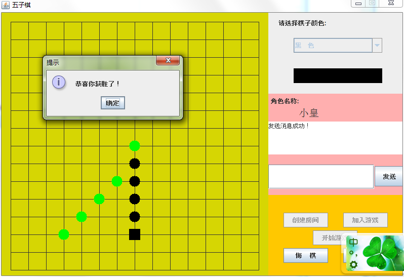

每次下棋结束，房间都会消失！

我们可以看一下服务器端显示的log信息，但是我并没有输出所有的log信息！

``` xml
服务器:xxxxx-PC/192.168.56.1:5024
用户连接:Socket[addr=/127.0.0.1,port=50897,localport=5024]
/sendname 小皇
用户连接:Socket[addr=/127.0.0.1,port=50910,localport=5024]

/sendname Tom/creategame Tom/listroom/joingame Tom 小皇
/startgame Tom 3/talk Tom 你先下吧/startgame 小皇 0/
chess 小皇 263 263/chess Tom 263 298/chess 小皇 228 333/chess Tom 263 333/chess 小皇 193 368/chess Tom 263 368/chess 小皇 158 403/chess Tom 263 403/chess 小皇 123 438
/youfail Tom
/listroom
/creategame Tom/listroom/joingame Tom 小皇/startgame Tom 3
/startgame 小皇 0
/chess 小皇 228 263/chess Tom 263 298/chess 小皇 228 333/chess Tom 298 298/giveup2 Tom
/creategame Tom/listroom/joingame Tom 小皇/startgame Tom 3/startgame 小皇 0
/chess 小皇 263 263/chess Tom 298 298/chess 小皇 228 298/chess Tom 193 333
/takeback Tom/
takeback2 小皇
/takeback Tom
/takeback2 小皇/giveup2 小皇
用户断开:Socket[addr=/127.0.0.1,port=50910,localport=5024]
```

## 总结

一个JAVA学习的练习，考验了java的一些基础知识，还是很不错的例子！如果你喜欢我的程序，或者运行时出现了BUG，还希望你能指出哦。